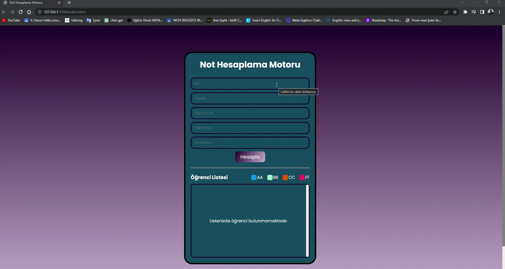

# Öğrenci Not Hesaplama Motoru

Kullanılan Teknoloji ve Yapılar

 HTML/CSS/SCSS/JAVASCRİPT
  ES5 ve ES6 fonksiyonları
  Local storage ile getitem ve setitem kullanıldı
  DOM yapısı ile HTML öğelerine ulaşılarak güncelleme işlemleri ve erişim işlemleri yapıldı
  Toastify kütüphanesi ile bildirim ekranı oluşturuldu
  Delete ve Edit işlemleri

  

